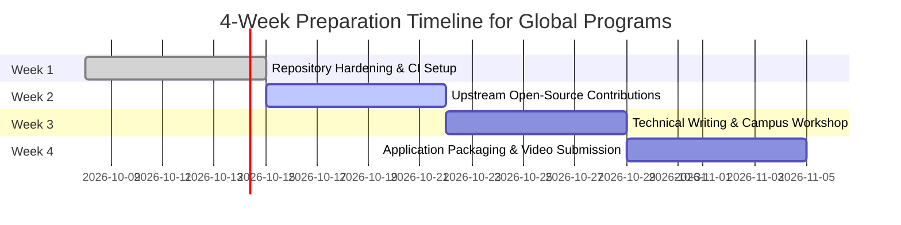

# 4-Week Strategic Readiness & Gap Bridging Roadmap

**Target Program:** GitHub Campus Experts (Feb 2027) & MLH Fellowship  
**Applicant:** Abaan Sufiyan | REVA University  

---

## 1. Readiness Assessment & Gap Audit

| Domain | Current Standing (Baseline) | Target Program Benchmark | Gap Severity | Bridging Strategy |
|---|---|---|:---:|---|
| **Git & Version Control** | Atomic commit history, feature branching (`add-projects-section`), GitHub Pages live. | Demonstrable mastery of upstream PRs, rebase workflows, and conflict resolution. | **Low** | Integrate GitHub Actions CI to validate code automatically. |
| **Algorithmic & Systems Code** | 14+ C++ solutions (LeetCode & HackerRank), C dynamic line editor. | Production code samples with modular architecture, clean documentation, and test suites. | **Low** | Document unit test harnesses and memory profiles. |
| **Upstream Open-Source Contributions** | All commits in personal & university course repositories. | Merged pull requests in third-party or community open-source repositories. | **High** | Target `good-first-issue` bugs in C/C++ developer tooling during Weeks 2 & 3. |
| **Campus Community Leadership** | Informal peer study partner and pair programming participant. | Documented record of organizing, speaking at, or leading student developer events. | **Medium-High** | Host a hands-on Git & CLI workshop for 2nd/3rd semester students at REVA. |
| **Technical Writing** | Markdown problem breakdowns with asymptotic complexities. | Public technical blog posts or tutorials explaining concepts to the wider community. | **Medium** | Publish a detailed guide on pointer memory safety and Valgrind debugging. |

---

## 2. 4-Week Actionable Timeline

### Week 1: Repository Hardening & Automated Testing
- **Goals:** Elevate existing repositories to enterprise standards.
- **Action Items:**
  - Add GitHub Actions CI workflow to `leetcode-solutions` and `Simple-Line-Editor-C` running GCC compiler checks on every push.
  - Standardize all repository READMEs with license badges, architecture diagrams, and clear contribution guidelines (`CONTRIBUTING.md`).
- **Deliverable:** Working green CI checkmark badges visible on all main branches.

### Week 2: First Upstream Open-Source Contributions
- **Goals:** Secure public pull request merges outside personal repositories.
- **Action Items:**
  - Query GitHub for `is:issue is:open label:"good first issue" language:c language:cpp`.
  - Review candidate projects (e.g., algorithm repositories, CLI developer tools).
  - Submit 2 PRs: one fixing documentation/tests, one resolving an edge-case bug.
- **Deliverable:** 1+ merged PR link in an established external GitHub repository.

### Week 3: Technical Writing & Campus Knowledge Sharing
- **Goals:** Demonstrate active community teaching and knowledge dissemination.
- **Action Items:**
  - Write and publish a technical article: *"Understanding Heap Memory and Preventing Buffer Overruns in C"* on Dev.to and LinkedIn.
  - Coordinate with REVA University CSE peers to host a 45-minute studio session: *"Git From Scratch: Branching, PRs, and Avoiding Merge Nightmares"*.
- **Deliverable:** Published technical article link + attendance log / workshop photos.

### Week 4: Application Assembly & Video Pitch
- **Goals:** Craft, polish, and submit competitive application materials.
- **Action Items:**
  - Finalize written application essays addressing local campus community needs.
  - Record a 2-minute high-definition video pitch outlining the vision for the REVA University developer community.
  - Conduct peer review with a mentor or senior student.
- **Deliverable:** Fully packaged application ready for submission portal.
